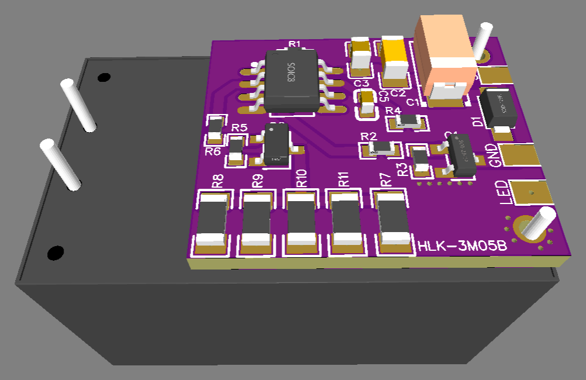
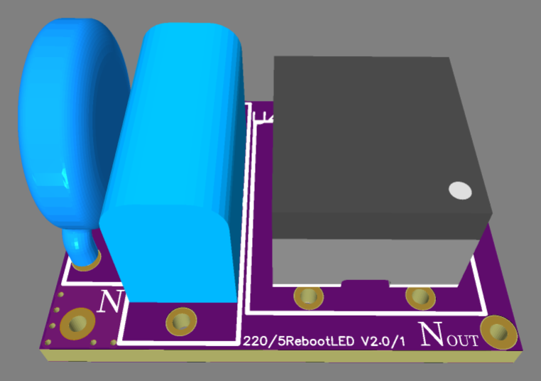

# HLK-3M05B

> Ultra-compact AC-DC (90–265 VAC to 5V/0.6A) power supply module with integrated 10-hour cyclic reboot and external signal emergency cutoff.

  

---

### ⚡ Electrical Specifications & Protection Features

* **🔌 Input**: **90 ~ 265 VAC** (50 / 60 Hz).
* **⚡ DC Output Power**:
  * **Regulated Output**: **5.0 VDC**
  * **Maximum Continuous Load Current**: up to **0.6 A** (3 W power class).
* **🔀 Switching Architecture**:
  * **Low-Side Switching with Soft-Start**: Efficient N-channel MOSFET ground-line switching with soft-start inrush protection. During output shutdown, the module seamlessly switches to a small internal dummy load to maintain converter stability, preserve efficiency, and eliminate output voltage ripple.
* **🛡️ Integrated Hardware Protections**:
  * **Short-Circuit Protection (SCP)**: Instant power cutoff under short-circuit conditions.
  * **Over-Current Protection (OCP)**: Built-in overload limiting.
* **📦 Packaging**: **IP65** (sealed encapsulated module resistant to moisture, dust, and vibration).
* **🌡️ Operating Temperature**: **-25 °C to +60 °C**.

---

### 🔌 Dedicated 220V Mains Filter Board

Dedicated external AC line filter board providing surge protection and Electromagnetic Interference (EMI) filtering (blocking high-frequency noise from 220V mains) — mandatory requirement for **EMC Certification**:

  
  

* **📏 Filter Board Dimensions**: **`24.8 × 18.4 mm`**.
* **🛡️ Mains Surge Protection**: High-voltage transient and surge clamping.
* **🧲 EMI Noise Filtering**: Differential high-frequency noise suppression.

---

### ⚙️ Operating Logic & `LED` Pin

* **⏱️ Cyclic Reboot Every 10 Hours**
* **🎛️ Event-Driven Control (`LED` Pin)**