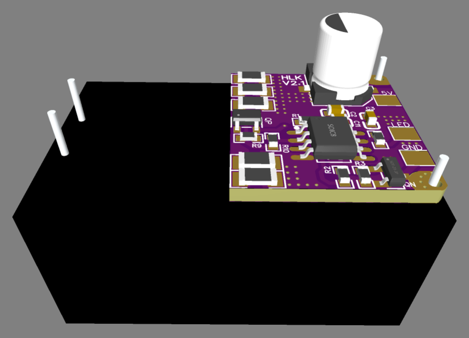
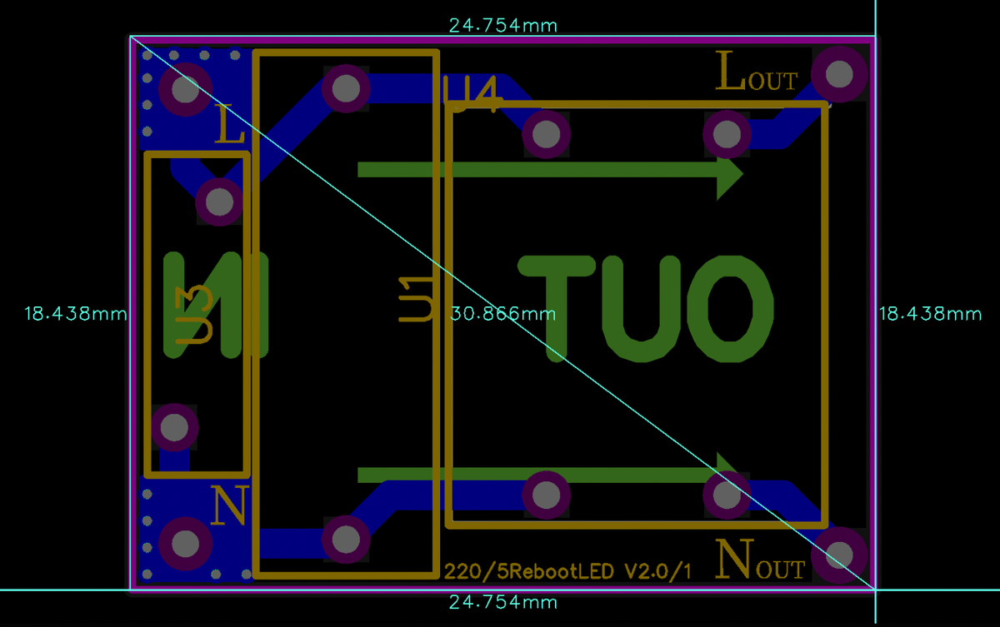

# HLK-5M05

> High-reliability 5W AC-DC (90–265 VAC to 5V/1.0A) power supply module with integrated 10-hour cyclic reboot, low-side power switch, and external emergency shutdown.

  

---

### ⚡ Electrical Specifications & Protection Features

* **🔌 Input**: **90 ~ 265 VAC** (50 / 60 Hz).
* **⚡ DC Output Power**:
  * **Regulated Output**: **5.0 VDC**
  * **Continuous Load Current**: up to **1.0 A** (5 W power class).
* **🔀 Switching Architecture**:
  * **Low-Side Switching with Soft-Start**: N-channel power MOSFET controlling the load return ground path with soft-start protection. During output shutdown, the module seamlessly switches to a small internal dummy load to maintain converter stability, preserve efficiency, and eliminate output voltage ripple.
* **🛡️ Integrated Hardware Protections**:
  * **Short-Circuit Protection (SCP)**: Fast cutoff upon output dead short with auto-recovery.
  * **Over-Current Protection (OCP)**: Safe current-limiting preventing power brick damage.
* **📦 Packaging**: **IP65** (sealed encapsulated module protecting against moisture, dust, and aggressive environments).
* **🌡️ Operating Temperature**: **-25 °C to +60 °C**.

---

### 🔌 Dedicated 220V Mains Filter Board

Dedicated external AC line filter board providing surge protection and Electromagnetic Interference (EMI) filtering (blocking high-frequency noise from 220V mains) — mandatory requirement for **EMC Certification**:

  
  

* **📏 Filter Board Dimensions**: **`24.8 × 18.4 mm`**.
* **🛡️ Mains Surge Protection**: High-voltage transient and surge clamping.
* **🧲 EMI Noise Filtering**: Differential high-frequency noise suppression.

---

### ⚙️ Operating Logic & `LED` Pin

* **⏱️ Cyclic Reboot Every 10 Hours**
* **🎛️ Event-Driven Control (`LED` Pin)**